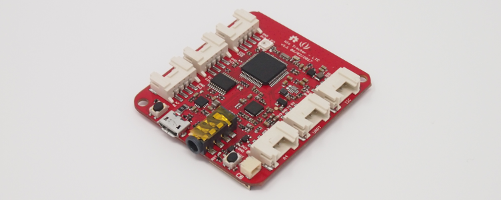
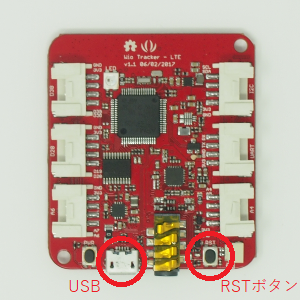
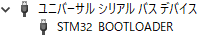
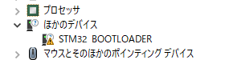
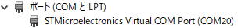
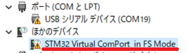

# wiolte-driver

Wio LTEのArduino IDE用ライブラリです。

## Wio LTE

Wio LTEは、Seeedが開発しているマイコンモジュールです。

GroveコネクターとSTM32F4マイコン、LTEモジュールが載っており、Arduino IDEで素早くプロトタイピングすることができます。

## 機能

|カテゴリー|機能|サンプルコード|関数名|注記|
|:--|:--|:--|:--|:--|
|電源制御|LTEモジュール電源||PowerSupplyLTE||
||Groveコネクター電源||PowerSypplyGrove||
|表示|フルカラーLED表示|basic/LedSetRGB|LedSetRGB||
|LTE|受信強度|basic/GetRSSI|GetReceivedSignalStrength||
||NTP時刻同期|basic/GetTime|SyncTime||
||SMS送信|sms/SendSMS|SendSMS|日本語未対応|
||SMS受信|sms/ReceiveSMS|ReceiveSMS|日本語未対応|
||UDP/TCPクライアント送信||SocketSend||
||UDP/TCPクライアント受信||SocketReceive||
||HTTPクライアントGET||HttpGet|ContentType固定[^1]/https未対応|
||HTTPクライアントPOST||HttpPost|ContentType固定[^1]/https未対応|

[^1]: application/x-www-form-urlencoded

## 開発環境のセットアップ

### Wio LTEのモードとデバイスドライバーの動作確認

Wio LTEのマイコンは、**DFUモード**と**通常モード**の2つのモードがあります。

**DFUモード**はArduino IDEで作成したプログラムをマイコンへ書き込むときに使用するモードで、**通常モード**はマイコンへ書き込んだプログラムを実行するモードです。

それぞれのモードが正しく動作しているか、必要なソフトウェアが入っているか、を確認しましょう。

#### DFUモード

**BOOTボタン**を押しながら**USBコネクター**にUSBケーブルを接続すると、マイコンがDFU(Device Firmware Upgrade)モードで起動します。

すでにUSBケーブルが接続されている場合は、**BOOTボタン**を押しながら**RSTボタン**をクリックして、DFUモードで再起動させることができます。

 

マイコンがDFUモードで起動すると、デバイスマネージャーの"ユニバーサルシリアルバスデバイス"配下に"STM32 BOOTLOADER"が表示されます。

> "STM32 BOOTLOADER"が"ほかのデバイス"配下に表示されている場合は、Zadigツールでデバイスドライバーの変更が必要です。
> 
> 

#### 通常モード

マイコンが通常モードで起動しているときにUSBケーブルを接続すると、デバイスマネージャーの"ポート"配下に"STMicroelectronics Virtual COM Port"が表示されます。

> "STMicroelectronics Virtual COM Port"が表示されておらず、"ほかのデバイス"配下に"STM32 Virtual ComPort in FS Mode"と表示されている場合は、Virtual COM Portデバイスドライバーのインストールが必要です。
> 
> 

### Arduino IDEの動作確認

### Wio LTEへプログラム書き込み

### Wio LTEのプログラム実行を確認

## 補足説明

### Virtual COM Portデバイスドライバーのインストール

1. [STマイクロエレクトロニクスのSTSW-STM32102サイト](http://www.st.com/content/st_com/ja/products/development-tools/software-development-tools/stm32-software-development-tools/stm32-utilities/stsw-stm32102.html)からSTSW-STM32102(en.stsw-stm32102.zip)を入手します。
1. en.stsw-stm32102.zipを解凍して、VCP_V1.4.0_Setup.exeを実行します。すると、C:\Program Files (x86)\STMicroelectronics\Software\Virtual comport driver にデバイスドライバーのインストールファイルが配置されます。
1. C:\Program Files (x86)\STMicroelectronics\Software\Virtual comport driver\Win8\dpinst_amd64.exe を実行します。これで、Visual COM Portデバイスドライバーがインストールされます。

### Arduino IDEのインストール

1. [ArduinoのSoftwareサイト](https://www.arduino.cc/en/Main/Software)のDownload the Arduino IDEにあるWindows Installerをクリックして、arduino-1.8.4-windows.exeを入手します。
1. arduino-1.8.4-windows.exeを実行します。

### Wio Tracker LTEボードの追加

1. Arduino IDEを起動します。
1. ファイル > 環境設定 の 設定タブ にある"追加のボードマネージャのURL:"に、https://raw.githubusercontent.com/Seeed-Studio/Seeed_Platform/master/package_seeeduino_boards_index.json を入力します。

1. ツール > ボード > ボードマネージャ で、Seeed STM32F4 Boards by Seeed Studio を選択し、インストールをクリックします。

